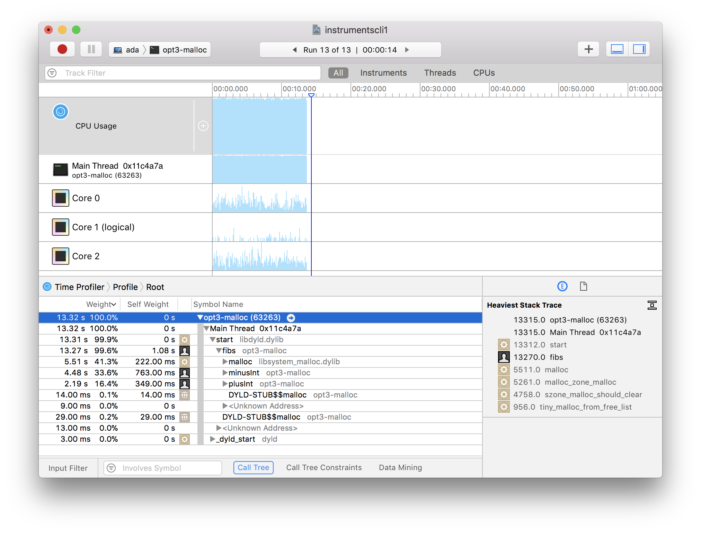
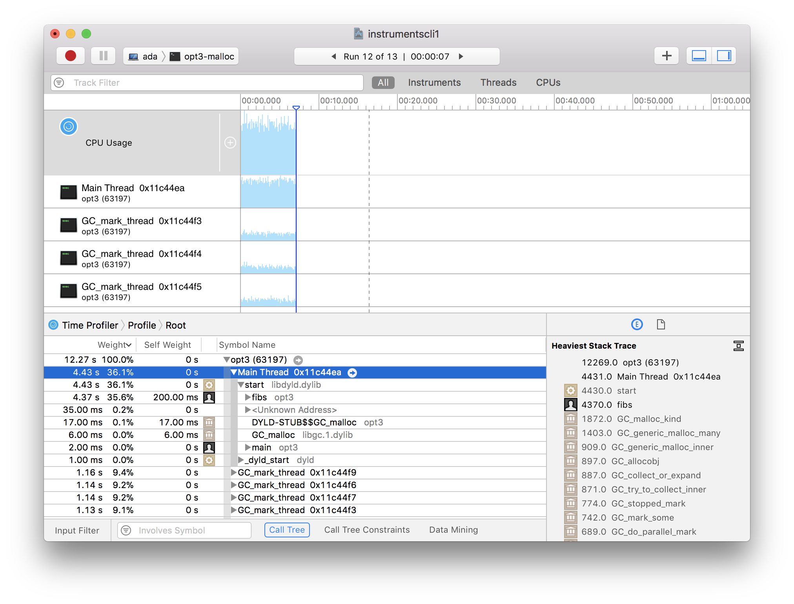

For the past year, I've been working on writing my own functional programming language. It's taught me a lot already, and there's still a lot more to learn. Recently, I improved the performance of of traits (typeclasses) significantly, but when I compared it to a ruby equivalent, it was still 4 times slower. Knowing that ruby isn't a particularily fast language, and that 2 seconds to (naively) count the first 33 fibonacci numbers is a lot, I decided to investigate.

Looking over the core language output from the compiler and the corresponding LLVM IR, I didn't see any obvious performance mistakes. The only thing that seemed to standout was `malloc`, since I needed to constantly allocate space for integers after every operation, it seemed like a reasonable candidate. But since the first step to optimization is to measure, I figured I needed to find a way to profile my code!

LLVM has support for tracking Debug Metadata [], but it requires me to annotate the IR the compiler produces with all sorts of information. It's something I'd like to do soon but don't have the time for yet. Hunting around the web led me to discover the `-debugify` pass, which attaches debug information to an IR file. This doesn't give me _source_-level debugging but it's more than good enough. Unfortunately `debugify` forgets to add a required `Debug Version Info` struct but it can easily be added by hand.

When you compile LLVM IR with `-g` in `clang`, it will generate the `dSYM` bundle you need to get name information into your debugger of choice. In my case I set up XCode's `Instruments.app` since I'm on a Mac. Profiler and instrumented binary in hand, I took a look at my runtimes!

It revealed exactly what I had suspected originally, a rare occurence! The calls to `malloc` were the ones taking up the runtime! This led me to doing something I had put off for a long time: adding a garbage collector!

Runtime dropped from 13.32sto 4.43s on the main thread! At some point in the future I'll have to learn how to properly generate source-level debug metadata, but not now.
