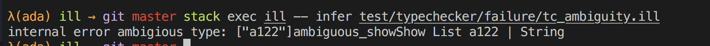
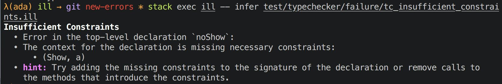

For the past week I've been going through a phase of tech-debt cleannup in Ill. One of the objectives is to come up with a unified type for compiler phases. Most phases already have a type along the lines of `Module a_i -> Either e_i (Module a_{i+1})`{.haskell}. But when it came time to compose two phases into a pipeline, I hit a problem:

```haskell
parse     :: Text -> Either ParseError (Module SourceSpan)
typecheck :: Module SourceSpan -> Either TypecheckError (Module TypeAnnotation)

(>=>) :: Monad m => (a -> m b) -> (b -> m c) -> (a -> m c)
--          v-- Here `m` is (Either ParseError).
pipeline = parse >=> typecheck
--                ^       ^-- and here it's (Either TypecheckError).
--                \-- leading to a unification error between the left and right sides of the pipeline.
```

This meant the error type at each phase either had to be shared by _all_ phases leading to an unwiedly sum _or_ I had to unpack it between each phase. To compound the problem, the errors I do report are already of very poor quality.

Starting with:


The goal is to end with something like:


I won't pretend to be an expert in error message design, but it's clear that the first image leaves a lot to be desired. For this error refactoring, I had a couple goals in mind.

- I wanted to easily understand _what_ the error was. This meant a clear title, the previous errors would often bury the actual message under 20 lines of location context.
- I wanted access to all the information on _how_ to resolve the error. Often, this is just returning more of the context at the site of the error: which constraints were missing, which terms failed to unify, etc...
- If possible provide context for users. This isn't really for me but for the ~~friends~~ unfortunate bystanders I coerce into writing example programs.

A long time ago I read a [couple](https://gist.github.com/chrisdone/fd6c6f6a8c5b5d4d3c3f91289343629f) of [great](https://github.com/jaspervdj/talks/blob/master/2017-skillsmatter-errors/slides.md#which-is-the-best-representation-2) posts on errors which presented a solution to this problem. They sat on the backburner while there were more important things to work on, but now I've decided to entirely overhaul the error handling as part of that.

I adopted Jasper's `Error` datatype, making that the shape of errors between subsystems. Internally, I'll use sum types to keep context about every error and then render it into a `Error` type at the subsystem boundary. While remaining generic, it retains enough structure to render intelligently.

```haskell
        -- v-- `a` is the type of the document annotations for `prettyprinter`
data Error a = Error
  { errHeader  :: Doc a   -- name of error (subject)
  , errKind    :: String  -- subsystem (sender)
  , errSummary :: Doc a   -- details of error (body)
  , errHints   :: [Doc a] -- solutions
  }

```

Then inside a pass I can use whatever error-reporting and handling methods I'd like, though I prefer to use an error ADT which holds the context for every error.

```haskell
data MyError = Error1 | ErrorInFunction Name MyError

-- a helper to provide additional context to an error

rethrow :: MonadError e m => (e -> e) -> m a -> m a
rethrow f action = action `catchError` (throwError . f )

```

This lets me build up a nested error that adds context at each level. Then a function renders that as an `Error a`. That context can be used in different ways to render each field, for example, generally I ignore the wrapping errors for the header but it's useful for the summary and hints.

With this new setup I get to keep both the descriptive internal error representation and a generic global representation. It also meanst that I can actually compose a pipeline together!


```haskell
parse     :: Text -> Either (Error ann) (Module SourceSpan)
typecheck :: Module SourceSpan -> Either (Error ann) (Module TypeAnnotation)

pipeline :: Text -> Either (Error ann) (Module TypeAnnotation)
pipeline = parse >=> typecheck -- yay, it compiles!
```

This gives me a solid error-reporting foundation to build off of. An idea for expansion I have is to build an `error-verbosity` flag that allows the user to decide how much detail to give. An expert user might not need as much information as a beginner and would prefer a denser output. I could also use this to build an `error-format=json` flag to explore editor integration / LSP.
