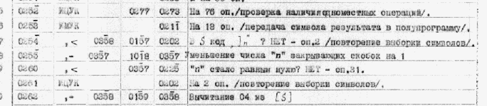

For the past 7 or so years, on and off, I've been recreating [the compiler](https://github.com/xldenis/besm) for the very first programming language created in the USSR

PP-BESM was the first  high-level language implemented in the Soviet Union, but it was building on a pre-existing theory of programming languages that was contemporaneously developed.


To read on my motivation you can see this _old_ [post](./besm).
I'm curious to see what other paths programming languages could have followed.
To explore the counterfactual, I want to put myself in the mindset of early Soviet CS researchers before there was much cross-pollination with American researchers on PL design.
.
My objective in this project is to recreate the original compiler as faithfully as possible, down to the machine code instructions used, so that I can have a bug-for-bug equivalent.

The longevity of this project means that each time I come back to it, I've learned new tricks and tools as an engineer, and this stint is no exception as it's coincided with the arrival of viable models for coding and the whole agentic development process.

## OCR and translations

I have two families of sources: a copy of "Programming Programme for the BESM computer", a book written by Andrey Ershov detailing the design of the language and providing high-level documentation of the compiler.
This book helps explain a lot of the reasoning and intention of the design but is fairly light on implementation details.
The second are machine code listings from the archives of Andrey that include machine code listings for an earlier revision of the compiler.

Unfortunately, since the documents are typewritten and the scans are moderately low resolution, quite a few letters blur together and become hard to distinguish.

This causes machine translation and OCR tools like Google Translate to trip up: if they can't reliably identify the source letters then the resulting translations turn into gibberish.
Since I don't speak Russian it becomes very challenging for me to determine if the errors are caused by single-letter substitutions or something deeper.
Historically this forced me into a tedious workflow in which I would manually transcribe words and run them through the translator, correcting lexicographic errors until the translation made sense.

This time around I tried a different workflow, feeding the scans into Claude Code and asking it to first transcribe into legible Russian and then subsequently translate into English.
The real breakthrough was asking Claude to loop over the translations by telling it that they should make grammatical sense in Russian, then when it would incorrectly parse a word, it was able to self-correct
Most of the time, the transcription messed up on a letter or two, which would mainly affect the declension or tense of a verb. Occasionally though this would go from total gibberish to sensible.
I also found that since the agent had the context that this was a technical text about a compiler, various abbreviations & terms were much easier to translate.
.
Having access to the transcribed Russian also provided me with an opportunity to perform a final spell checking, which allowed me to catch the remaining typos before translating to English.

I did find that the grid layout of the documents caused a lot of hallucinations, and that I was much better served by first chopping up the documents into individual lines before feeding those in for transcription, but that was comparatively much less work.

The improved translation workflow helped me fully transcribe and translate the entire remaining source code, and I was able to far more quickly complete my initial pass on PP-3, the final remaining phase of the compiler.

## Agentic Archeology

Debugging the PP-BESM compiler leverages the tooling I've built into the VM directly: breakpoints and tracing.
Historically this tooling was interactive: breakpoints were set in the VM TUI and had to be re-set each time the VM was reloaded.
This made iterating on specific bugs quite tedious since things might subtly shift between runs and I would have to re-determine the correct breakpoint locations.

<video controls loop autoplay playsinline width="100%">
    <source src="./software-archeology/tui.mp4" type="video/mp4" />
</video>

<!-- short video of tui w debugger view -->

In my day job, I've found that Claude tends to be quite good at identifying which lines of code produce a specific behavior, why not here?
To make that possible I augmented the VM with a bunch of CLI driven functionality, built into the VM's tracing functions.
Each time the compiler is compiled I generate metadata mappings of all basic blocks and variables to their addresses in memory. These can be used to set breakpoints when an address is executed or written to as well as printing for ranges of addresses to see what memory looks like at various stages.

Adding the ability to specify breakpoints on the command line made it possible to drive this whole loop through an agent, especially when combined with the ability to print values from memory when a breakpoint is hit.
Thus, when I'm debugging a specific problem in the compiler, like identifying why loops are being miscompiled, I ask Claude to trace what happens to specific values during compilation and it iteratively steps through the execution to hunt down the flow of data.

<!-- 

<pre style="white-space: pre;">
cargo run --release -- trace --bootloader=boot.txt --md0=mp1.txt --md4=mp2.txt --start-address=1025
    --md3=mp3.txt--md2=test_progs/sum_loop.txt --op-breakpoint=3:4:1 --print-memory=15:22 --no-trace
Operator breakpoint triggered - Pass: 3, Procedure: 4, Operator: 1
  15  0 0 0 750             0.0000001746  00000002ee  000000000000000000000000000001011101110
  16  0 19 20 0             0.0185642242  0004c0a000  000000000000100110000001010000000000000
  17  0 16 0 0              00000.015625  0004000000  000000000000100000000000000000000000000
  18  TN      19        16  76.000015258  1804c00010  001100000000100110000000000000000010000
  19  Add     16   18  684  0.0312674846  02040092ac  000001000000100000000001001001010101100
  20  ,Add    16    0   16  000134217760  4204000010  100001000000100000000000000000000010000
  21  Cmp     16   20    8  16394.001953  280400a008  010100000000100000000001010000000001000
  22  Stop                  001098395398  3f82f05e0c  011111110000010111100000101111000001100
</pre>

 -->

This new workflow has allowed me to significantly step up my debugging throughput, as while I work on a patch to one bug an agent can be running in the background to reproduce and isolate a different bug.
I have found however that Claude is _hopeless_
My objective is to obtain an as accurate as possible recreation of the compiler, down to the individual instructions.
I've found that coding models just aren't able to account for self-modifying code.
For example, loops often increment the addresses in transfers to iterate over arrays.
 when it comes to actually writing code for PP-BESM, the compiler is written in a self-referential and self-mutating manner that Claude just can't effectively reason about.

## Going forward

My objective with BESM is to have a fully functional compiler, which I can use to explore early Soviet ideas of programming. The desire to accurately recreate the language has made things much more challenging but also very curious. The amount of work involved in making incremental progress has been challenging to balance, so I welcome any improvements in workflow however minor they are.

If you're interested in playing with the compiler today, you can find it [here](https://github.com/xldenis/besm).